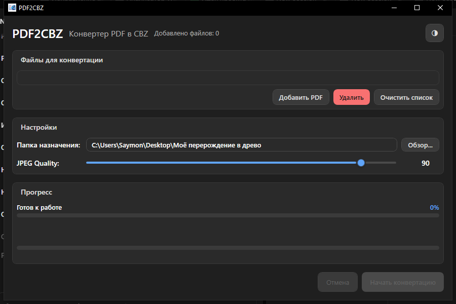

# PDF2CBZ

Конвертер PDF в CBZ для читалок манги и комиксов (Mihon и подобные).
Закинул PDF пачкой → получил CBZ с пронумерованными JPEG-страницами.

## Скриншоты



## Кому пригодится

- **Читалки не едят PDF.** Манга и комиксы в PDF неудобно читать на телефоне/ридере — CBZ открывается везде (Mihon, CDisplayEx, Chunky и др.).
- **Пачка томов.** Пакетная конвертация всего списка за один проход с общим прогрессом и ETA.
- **Контроль качества и размера.** Настройка JPEG-качества: максимум деталей или компактный файл.
- **Аккуратный порядок страниц.** Имена с нумерацией под ширину (`001.jpg` … `240.jpg`) — страницы не перемешаются.
- **Без потерь при повторе.** Режимы при конфликте имён: спросить, заменить, пропустить.
- **Длинные очереди не страшны.** Отмена в один клик, недописанные файлы удаляются сами.

## Возможности

- Drag&drop и диалог выбора (мультивыбор)
- Пакетная конвертация, прогресс по файлу и общий, ETA
- Качество JPEG 1–100, DPI рендера 150
- Темы: светлая / тёмная / системная, тёмный заголовок Windows
- Безопасная запись: сначала `.cbz.tmp`, потом переименование в `.cbz`

## Запуск

Нужен [.NET 8 Runtime](https://dotnet.microsoft.com/download/dotnet/8.0).

```bat
dotnet run --project PDF2CBZ
```

## Сборка

```bat
dotnet build PDF2CBZ -c Release
```

Готовый файл: `PDF2CBZ\bin\Release\net8.0-windows\PDF2CBZ.exe` (+ `pdfium.dll` рядом).

## Стек

C#, WPF, .NET 8, PdfiumViewer (рендер PDF)
